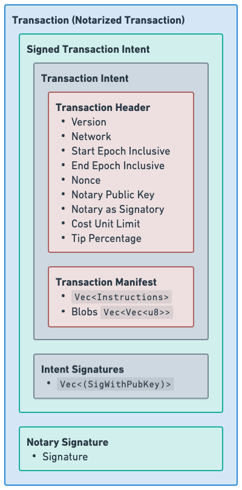

<div align="center">
  <h1><code>TypeScript Radix Engine Toolkit</code></h1>
  <p>
    <strong>A TypeScript wrapper for the Radix Engine Toolkit that provides many necessary tools to interact with the Radix ledger</strong>
  </p>

[](https://opensource.org/licenses/Apache-2.0)
</div>

# About

This library brings the same support offered to Rust for transaction construction, validation, and decompilation, manifest parsing, **S**crypto **B**inary **O**bject **R**epresentation (SBOR) encoding and decoding, address derivations, and more to TypeScript and JavaScript through a [Rust backend](https://www.github.com/radixdlt/radix-engine-toolkit) that powers it all. The following is a list of the features offered by this library:

- Offline transaction construction and transaction manifest construction.
- Cryptographic primitives for signing and notarizing transactions.
- Static (offline) transaction validation.
- The ability to convert manifests into their Abstract Syntax Tree (AST) representation and back to their string representation.
- Full support for all flavors of SBOR allowing clients to perform SBOR encoding and decoding.
- The ability to perform deterministic mapping of public keys to virtual account addresses, virtual component addresses, and Olympia account addresses. In addition to the ability to perform the deterministic mapping from Olympia account addresses to Babylon account addresses
- All of the needed features to build a complete programmatic wallet as evident by the iOS and Android wallet which utilize Radix Engine Toolkit wrappers in their respective languages.

# Usage Guide

Depending on what your needs are, there are different classes with varying interfaces,
complexity, and degrees of backward compatability that you can use. More specifically:

- If you are an integrator with basic needs (e.g., you only need to perform fungible resource transfers with a single signer) who would like a simple interface with backward compatibility guarantees, then use [`LTSRadixEngineToolkit`](./LTS.md).
- If you have more advanced needs, you want to use the [`RadixEngineToolkit`](#functionality) class. This has no backwards compatibility guarantees but is more powerful and capable.

# Architecture

The TypeScript Radix Engine Toolkit library is powered by the [Core Radix Engine Toolkit](https://github.com/radixdlt/radix-engine-toolkit/): a library written entirely in Rust that can be compiled to Web-Assembly modules, native libraries, and other targets supported by the Rust compiler. The Core Radix Engine Toolkit contains all of the core functionality, while this TypeScript library is simply a wrapper around the core Radix Engine Toolkit that is able to make invocations to it and interpret its responses.

This TypeScript wrapper around the Radix Engine Toolkit uses the Web-Assembly as the method of interoperability between the Rust code and TypeScript. More specifically, this wrapper acts as a Web-Assembly host that invokes the core Radix Engine Toolkit and interprets its responses. In addition to that, this wrapper builds higher level abstractions above the concept of Web-Assembly function invocation where it builds an idiomatic TypeScript API which translates down to Radix Engine Toolkit Web-Assembly function invocations without the need to deal in raw requests and responses.

Since the core functionality of this library is included in the compiled Web-Assembly module, this library needs to be used in an environment that can act as a Web-Assembly host which most browsers and Node.JS do support.

There are three main classes that act as entry points into the Radix Engine Toolkit, before discussing them in detail, the following is a quick summary:

- Do not use the `RawRadixEngineToolkit` class as this is a class meant for the internal usage of the Radix Engine Toolkit and has no guarantees whatsoever on backward compatibility.
- If you are a developer using this library, you want to use the `RadixEngineToolkit` class.
- If you are an integrator who cares about having an interface with little changes and wish for higher backward compatibility guarantees, then use [`LTSRadixEngineToolkit`](./LTS.md).

| Class Name                          | Functionality                                                                                                                                                                                                                                                                                                                                                                                                                                                                                                                                                                                     |
| ----------------------------------- | ------------------------------------------------------------------------------------------------------------------------------------------------------------------------------------------------------------------------------------------------------------------------------------------------------------------------------------------------------------------------------------------------------------------------------------------------------------------------------------------------------------------------------------------------------------------------------------------------- |
| `RawRadixEngineToolkit`             | The main wrapper and WASM host around the Radix Engine Toolkit, this class abstracts the complexity of performing WASM invocation down to a single simple `invoke` function that can be called with a function pointer, some arguments for the function, and the type of the return. This class is not very user friendly to use since it deals in the raw request and response objects required by the core Radix Engine Toolkit. Thus, you will almost never find yourself using this class except in very niche cases.                                                                         |
| `RadixEngineToolkit`                | The main developer facing class that is used to invoke the core Radix Engine Toolkit. The interface of the functions defined on this class does not use the request and response objects. Instead, it provides a more idiomatic TypeScript/JavaScript interface that is familiar to developers and that is easy to use. Under the hood, the functions exposed in this class translate down to core Radix Engine Toolkit requests and are then forwarded to the appropriate functions on the `RawRadixEngineToolkit` class. This is the class that you will most likely use very often.            |
| [`LTSRadixEngineToolkit`](./LTS.md) | A thin wrapper around the `RadixEngineToolkit` class that exposes an API that will has much higher backward compatibility guarantees. The [`LTSRadixEngineToolkit`](./LTS.md) class is not meant to provide all of the functionality of the toolkit; quite the opposite: it's meant to provide little functionality with well defined simpler interfaces that won't change that integrators can use. However, it is very likely that some clients might quickly "outgrow" this class and it's simple interfaces. Clients who encounter that are recommended to use the `RadixEngineToolkit` class |

# Installation

The library is published to npmjs.com and can be installed through npm, yarn, or other package managers.

## Yarn

```sh
yarn add @radixdlt/radix-engine-toolkit
```

## Npm

```sh
npm install @radixdlt/radix-engine-toolkit
```

# High Level Functionality

This library comes with a number of high-level functionalities that can be useful to a number of clients. Among those functionalities is the ability to build manifests and construct transactions.

## Building Manifests

The Radix Engine Toolkit comes with a manifest builder which is heavily inspired by the builder present in the Scrypto repository and commonly seen in unit tests. This manifest builder has an ID allocator which allows users of the builder to not specify the ids for various buckets and proofs created in the manifest. Additionally, the manifest builder is able to handle blobs in a more developer friendly way for instructions such as `PublishPackage`.

The following example constructs a transaction manifest for a resource transfer where some tokens are withdrawn from an account, put in a bucket, and the deposited into another account.

```ts
import {
  ManifestBuilder,
  address,
  bucket,
  decimal,
} from "@radixdlt/radix-engine-toolkit";

const manifest = new ManifestBuilder()
  .callMethod(
    "account_sim1q3cztnp4h232hsfmu0j63f7f7mz5wxhd0n0hqax6smjqznhzrp",
    "withdraw",
    [
      address(
        "resource_sim1qf7mtmy9a6eczv9km4j4ul38cfvap0zy6juuj8m8xnxqlla6pd"
      ),
      decimal(10),
    ]
  )
  .takeAllFromWorktop(
    "resource_sim1qf7mtmy9a6eczv9km4j4ul38cfvap0zy6juuj8m8xnxqlla6pd",
    (builder, bucketId) =>
      builder.callMethod(
        "account_sim1qs5mg6tcehg95mugc9d3lpl90clnl787zmhc92cf04wqvqvztr",
        "try_deposit_or_abort",
        [bucket(bucketId)]
      )
  )
  .build();
console.log(manifest.toString());
```

## Constructing Transactions

The Radix Engine toolkit comes with a transaction builder through the `TransactionBuilder` class that is very similar to that seen in the Scrypto repository. The transaction builder allows for the construction of transactions all the way from the header to the notarized transactions. The main purpose of the builder is to abstract the complexities of transaction construction away from the developer since using the transaction builder does not require the user to have knowledge of transaction compilation, hashing, or anything else of that sort. It, alongside the `ManifestBuilder`, makes the transaction construction process much simpler.

The following example shows the transaction builder can be used to construct a transaction.

```ts
import {
    ManifestBuilder,
    NetworkId,
    NotarizedTransaction,
    PrivateKey,
    RadixEngineToolkit,
    TransactionBuilder,
    TransactionHeader,
    TransactionManifest,
    address,
    bucket,
    decimal,
    defaultValidationConfig,
    generateRandomNonce,
} from "@radixdlt/radix-engine-toolkit";

// For this transaction, we wish to have multiple signers (and of course, a single notary). So, we
// define their cryptographic private keys.
const notaryPrivateKey = new PrivateKey.Secp256k1(
    "40c1b9deccc56c0da69821dd652782887b5d31fe6bf6ead519a23f9e9472b49b"
);

const signer1PrivateKey = new PrivateKey.Ed25519(
    "69366e446ad19a7540b4272c614bbc2b242656815eb03b1d29a53c950201ae76"
);
const signer2PrivateKey = new PrivateKey.Secp256k1(
    "5068952ca5aa655fe9257bf2d89f3b86f4dda6be6f5b76e4ed104c38fd21e8d7"
);

// We first begin by creating the transaction header that will be used for the transaction.
const transactionHeader: TransactionHeader = {
    networkId: NetworkId.Simulator,
    startEpochInclusive: 3910,
    endEpochExclusive: 3920,
    nonce: await generateRandomNonce(),
    notaryPublicKey: notaryPrivateKey.publicKey(),
    notaryIsSignatory: true,
    tipPercentage: 0,
};

// We then build the transaction manifest
const transactionManifest: TransactionManifest = new ManifestBuilder()
    .callMethod(
        "account_sim1q3cztnp4h232hsfmu0j63f7f7mz5wxhd0n0hqax6smjqznhzrp",
        "withdraw",
        [
            address(
                "resource_sim1qf7mtmy9a6eczv9km4j4ul38cfvap0zy6juuj8m8xnxqlla6pd"
            ),
            decimal(10),
        ]
    )
    .takeAllFromWorktop(
        "resource_sim1qf7mtmy9a6eczv9km4j4ul38cfvap0zy6juuj8m8xnxqlla6pd",
        (builder, bucketId) =>
            builder.callMethod(
                "account_sim1qs5mg6tcehg95mugc9d3lpl90clnl787zmhc92cf04wqvqvztr",
                "try_deposit_or_abort",
                [bucket(bucketId)]
            )
    )
    .build();

// We may now build the complete transaction through the transaction builder.
const transaction: NotarizedTransaction = await TransactionBuilder.new().then(
    (builder) =>
        builder
            .header(transactionHeader)
            .manifest(transactionManifest)
            .sign(signer1PrivateKey)
            .sign(signer2PrivateKey)
            .notarize(notaryPrivateKey)
);

const transactionId = await RadixEngineToolkit.NotarizedTransaction.intentHash(
    transaction
);
console.log(transactionId);

// Check that the transaction that we've just built is statically valid.
await RadixEngineToolkit.NotarizedTransaction.staticallyValidate(
    transaction,
    defaultValidationConfig(NetworkId.Simulator)
).then((validation) => {
    if (validation.kind === "Invalid") {
        throw new Error("Transaction is invalid");
    }
});
```

The constructed transaction can then be compiled and submitted to the Network Gateway to be processed by the network.

As can be seen in the calls to `sign` and `notarize` these methods take in a private key as an argument. However, some clients might wish not to expose their private keys to the transaction builder for various security concerns, or since an HSM is being used. In this case, the `sign` and `notarize` functions can be called with signature functions as an arguments. These functions would take in the hash to sign and would need to return back a `Signature.Signature` or a `SignatureWithPublicKey.SignatureWithPublicKey`. The following is an example of how that can be achieved.

```ts
import {
    ManifestBuilder,
    NetworkId,
    NotarizedTransaction,
    RadixEngineToolkit,
    Signature,
    SignatureWithPublicKey,
    TransactionBuilder,
    TransactionHeader,
    TransactionManifest,
    ValidationConfig,
    address,
    bucket,
    decimal,
    defaultValidationConfig,
    generateRandomNonce,
} from "@radixdlt/radix-engine-toolkit";

// @ts-ignore
const signIntent = (hashToSign: Uint8Array): SignatureWithPublicKey => {
    /* This method takes in the hash to sign, signs it, and then returns it as a SignatureWithPublicKey */
};

// @ts-ignore
const notarizeIntent = (hashToSign: Uint8Array): Signature => {
    /* This method takes in the hash to sign, signs it, and then returns it as a Signature */
    throw new Error("Not implemented");
};

// We first begin by creating the transaction header that will be used for the transaction.
const transactionHeader: TransactionHeader = {
    networkId: NetworkId.Simulator,
    startEpochInclusive: 3910,
    endEpochExclusive: 3920,
    nonce: await generateRandomNonce(),
    notaryPublicKey: notaryPublicKey,
    notaryIsSignatory: true,
    tipPercentage: 0,
};

// We then build the transaction manifest
const transactionManifest: TransactionManifest = new ManifestBuilder()
    .callMethod(
        "account_sim1q3cztnp4h232hsfmu0j63f7f7mz5wxhd0n0hqax6smjqznhzrp",
        "withdraw",
        [
            address(
                "resource_sim1qf7mtmy9a6eczv9km4j4ul38cfvap0zy6juuj8m8xnxqlla6pd"
            ),
            decimal(10),
        ]
    )
    .takeAllFromWorktop(
        "resource_sim1qf7mtmy9a6eczv9km4j4ul38cfvap0zy6juuj8m8xnxqlla6pd",
        (builder, bucketId) =>
            builder.callMethod(
                "account_sim1qs5mg6tcehg95mugc9d3lpl90clnl787zmhc92cf04wqvqvztr",
                "try_deposit_or_abort",
                [bucket(bucketId)]
            )
    )
    .build();

// We may now build the complete transaction through the transaction builder.
const transaction: NotarizedTransaction = await TransactionBuilder.new().then(
    (builder) =>
        builder
            .header(transactionHeader)
            .manifest(transactionManifest)
            .sign(signIntent)
            .notarize(notarizeIntent)
);
const transactionId = await RadixEngineToolkit.NotarizedTransaction.intentHash(
    transaction
);
console.log(transactionId);

// Check that the transaction that we've just built is statically valid.
await RadixEngineToolkit.NotarizedTransaction.staticallyValidate(
    transaction,
    defaultValidationConfig(NetworkId.Simulator)
).then((validation) => {
    if (validation.kind === "Invalid") {
        throw new Error("Transaction is invalid");
    }
});
```

# Functionality

This section discusses the raw functionality offered by the TypeScript Radix Engine Toolkit and provides examples for how they can be achieved in code.

## Convert Manifest

The most common format for transaction manifests is the string format seen in Radix Transaction Manifest `.rtm` files and in other places as well. However, there does exist another format for representing manifests: the `Parsed` format.

While the `String` format of manifests focuses heavily on being easily human-readable with some focus on ease of parsing and lexing, the `Parsed` format focuses more heavily on being very machine-readable where it should be relatively easy for machines to understand, process, and work with the `Parsed` format. The `Parsed` format is a JSON format for the instructions of transaction manifests that represents instructions as an Abstract Syntax Tree (AST).

Both of the manifest format compile down to identical byte code; thus, using either of the formats purely comes down to a choice by the client to either favor human-readability or machine-readability, some clients could choose to make use of both formats in different places which is what the Babylon wallet does.

The following is the same manifest represented in both formats:

<details>
    <summary><code>String</code> Format</summary>

```ruby
CALL_METHOD
    Address("account_sim1qjy5fakwygc45fkyhyxxulsf5zfae0ycez0x05et9hqs7d0gtn")
    "withdraw"
    Address("resource_sim1qyqqqqqqqqqqqqqqqqqqqqqqqqqqqqqqqqqqqqqqqqqqs6d89k")
    Decimal("5");
TAKE_FROM_WORKTOP_BY_AMOUNT
    Decimal("2")
    Address("resource_sim1qyqqqqqqqqqqqqqqqqqqqqqqqqqqqqqqqqqqqqqqqqqqs6d89k")
    Bucket("bucket1");
CALL_METHOD
    Address("component_sim1qd8djmepmq7hxqaakt9rl3hkce532px42s8eh4qmqlks9f87dn")
    "buy_gumball"
    Bucket("bucket1");
ASSERT_WORKTOP_CONTAINS_BY_AMOUNT
    Decimal("3")
    Address("resource_sim1qyqqqqqqqqqqqqqqqqqqqqqqqqqqqqqqqqqqqqqqqqqqs6d89k");
ASSERT_WORKTOP_CONTAINS
    Address("resource_sim1q2ym536cwvvf3cy9p777t4qjczqwf79hagp3wn93srvsgvqtwe");
TAKE_FROM_WORKTOP
    Address("resource_sim1qyqqqqqqqqqqqqqqqqqqqqqqqqqqqqqqqqqqqqqqqqqqs6d89k")
    Bucket("bucket2");
RETURN_TO_WORKTOP
    Bucket("bucket2");
TAKE_FROM_WORKTOP_BY_IDS
    Array<NonFungibleLocalId>(NonFungibleLocalId("#1#"))
    Address("resource_sim1qyqqqqqqqqqqqqqqqqqqqqqqqqqqqqqqqqqqqqqqqqqqs6d89k")
    Bucket("bucket3");
CALL_METHOD
    Address("account_sim1qjy5fakwygc45fkyhyxxulsf5zfae0ycez0x05et9hqs7d0gtn")
    "deposit_batch"
    Expression("ENTIRE_WORKTOP");
```

</details>

<details>
    <summary><code>Parsed</code> Format</summary>

```json
[
  {
    "instruction": "CALL_METHOD",
    "component_address": {
      "type": "Address",
      "address": "account_sim1qjy5fakwygc45fkyhyxxulsf5zfae0ycez0x05et9hqs7d0gtn"
    },
    "method_name": {
      "type": "String",
      "value": "withdraw"
    },
    "arguments": [
      {
        "type": "Address",
        "address": "resource_sim1qyqqqqqqqqqqqqqqqqqqqqqqqqqqqqqqqqqqqqqqqqqqs6d89k"
      },
      {
        "type": "Decimal",
        "value": "5"
      }
    ]
  },
  {
    "instruction": "TAKE_FROM_WORKTOP_BY_AMOUNT",
    "resource_address": {
      "type": "Address",
      "address": "resource_sim1qyqqqqqqqqqqqqqqqqqqqqqqqqqqqqqqqqqqqqqqqqqqs6d89k"
    },
    "amount": {
      "type": "Decimal",
      "value": "2"
    },
    "into_bucket": {
      "type": "Bucket",
      "identifier": {
        "type": "String",
        "value": "bucket1"
      }
    }
  },
  {
    "instruction": "CALL_METHOD",
    "component_address": {
      "type": "Address",
      "address": "component_sim1qd8djmepmq7hxqaakt9rl3hkce532px42s8eh4qmqlks9f87dn"
    },
    "method_name": {
      "type": "String",
      "value": "buy_gumball"
    },
    "arguments": [
      {
        "type": "Bucket",
        "identifier": {
          "type": "String",
          "value": "bucket1"
        }
      }
    ]
  },
  {
    "instruction": "ASSERT_WORKTOP_CONTAINS_BY_AMOUNT",
    "resource_address": {
      "type": "Address",
      "address": "resource_sim1qyqqqqqqqqqqqqqqqqqqqqqqqqqqqqqqqqqqqqqqqqqqs6d89k"
    },
    "amount": {
      "type": "Decimal",
      "value": "3"
    }
  },
  {
    "instruction": "ASSERT_WORKTOP_CONTAINS",
    "resource_address": {
      "type": "Address",
      "address": "resource_sim1q2ym536cwvvf3cy9p777t4qjczqwf79hagp3wn93srvsgvqtwe"
    }
  },
  {
    "instruction": "TAKE_FROM_WORKTOP",
    "resource_address": {
      "type": "Address",
      "address": "resource_sim1qyqqqqqqqqqqqqqqqqqqqqqqqqqqqqqqqqqqqqqqqqqqs6d89k"
    },
    "into_bucket": {
      "type": "Bucket",
      "identifier": {
        "type": "String",
        "value": "bucket2"
      }
    }
  },
  {
    "instruction": "RETURN_TO_WORKTOP",
    "bucket": {
      "type": "Bucket",
      "identifier": {
        "type": "String",
        "value": "bucket2"
      }
    }
  },
  {
    "instruction": "TAKE_FROM_WORKTOP_BY_IDS",
    "resource_address": {
      "type": "Address",
      "address": "resource_sim1qyqqqqqqqqqqqqqqqqqqqqqqqqqqqqqqqqqqqqqqqqqqs6d89k"
    },
    "ids": [
      {
        "type": "NonFungibleLocalId",
        "value": {
          "type": "Integer",
          "value": "1"
        }
      }
    ],
    "into_bucket": {
      "type": "Bucket",
      "identifier": {
        "type": "String",
        "value": "bucket3"
      }
    }
  },
  {
    "instruction": "CALL_METHOD",
    "component_address": {
      "type": "Address",
      "address": "account_sim1qjy5fakwygc45fkyhyxxulsf5zfae0ycez0x05et9hqs7d0gtn"
    },
    "method_name": {
      "type": "String",
      "value": "deposit_batch"
    },
    "arguments": [
      {
        "type": "Expression",
        "value": "ENTIRE_WORKTOP"
      }
    ]
  }
]
```

</details>

When converting the instructions of a `TransactionManifest` from one format to another, there are typically two main arguments required:

1. The format of the instructions to receive back, this is provided as an `InstructionList.Kind` which can either be `String` or `Parsed`.
2. The id of the network that the manifest is meant for. This is used in two main ways:
   - Validating that the addresses present in the manifest belong to the specified network.
   - Bech32m encoding the addresses during the conversion process.


```ts
import {
    TransactionManifest,
    NetworkId,
    RadixEngineToolkit,
} from "@radixdlt/radix-engine-toolkit";

// @ts-ignore: You define your manifest
const transactionManifest: TransactionManifest = undefined;
const convertedInstructions = await RadixEngineToolkit.Instructions.convert(
    transactionManifest.instructions,
    NetworkId.Mainnet,
    "String"
);
```

## Transaction Compilation

The TypeScript Radix Engine Toolkit allows for transaction intents of various kinds to be compiled. The compilation of transaction intents is an essential part of transaction construction since what is signed is the hash of the compiled intents and not the human readable intents. The need to compile intents is abstracted away by the `TransactionBuilder` and the `ActionTransactionBuilder` classes (discussed elsewhere in this document) which allows clients to construct transactions without the need to understand or worry about the internals of how it is done.

There are three main transaction intent types and the Radix Engine Toolkit allows for the compilation (and decompilation as well) of all three of the transaction intent types, the intent types are:

1. **(Unsigned) Transaction Intent:** contains the `TransactionManifest` and the `TransactionHeader` of the transaction which describe all of the asset movements as well as the transaction bounds, constraints, and notary.
2. **Signed Transaction Intent:** consists of the (Unsigned) `TransactionIntent` and zero or more intent signatures (`SignatureWithPublicKey`).
3. **Notarized Transaction Intent:** consists of the `SignedTransactionIntent` and exactly one notary signature (`Signature`) where the public key of the notary must match that present in the transaction intent.

The following image shows the structure of transactions in Babylon:

<p align="center">
  
</p>

### Compiling `TransactionIntent`s

Given a `TransactionIntent` object, the `RadixEngineToolkit` class can be used to compile the it down to a byte array of SBOR bytes.

```ts
import { Intent, RadixEngineToolkit } from "@radixdlt/radix-engine-toolkit";

// @ts-ignore: defined by you
const transactionIntent: Intent = undefined;
const compiledIntent = await RadixEngineToolkit.Intent.compile(
    transactionIntent
);
```

### Compiling `SignedTransactionIntent`s

Given a `SignedTransactionIntent` object, the `RadixEngineToolkit` class can be used to compile the it down to a byte array of SBOR bytes.

```ts
import {
    SignedIntent,
    RadixEngineToolkit,
} from "@radixdlt/radix-engine-toolkit";

// @ts-ignore: defined by you
const signedSignedIntent: SignedIntent = undefined;
const compiledSignedIntent = await RadixEngineToolkit.SignedIntent.compile(
    signedSignedIntent
);

```

### Compiling `NotarizedTransaction`s

Given a `NotarizedTransaction` object, the `RadixEngineToolkit` class can be used to compile the it down to a byte array of SBOR bytes.

```ts
import {
    NotarizedTransaction,
    RadixEngineToolkit,
} from "@radixdlt/radix-engine-toolkit";

// @ts-ignore: defined by you
const notarizedTransaction: NotarizedTransaction = undefined;
const compiledNotarizedTransaction =
    await RadixEngineToolkit.NotarizedTransaction.compile(notarizedTransaction);
```

## Transaction Decompilation

The TypeScript Radix Engine Toolkit is capable of decompiling transaction intents from their SBOR byte array format to a human-readable/machine-readable format that's easy to understand, read, and parse. This is useful when verifying transactions before signing them to ensure that they contain the intent that was communicated.

Similar to compilation, the Radix Engine Toolkit is able to decompile all three transaction intent types: (Unsigned) Transaction intents, signed transaction intents, and notarized transaction intents.

During decompilation, the client is free to choose the format of the output manifest instructions which can either be `String` or `Parsed`. The `String` format is the most common format and is the one seen in the `.rtm` files, in the radixdlt-scrypto repository, and almost everywhere. The `Parsed` format is a less common format but one which a number of programmatic clients heavily rely on which represents manifests as an AST of the various tokens in the tree.

### Decompiling a `TransactionIntent`

Given a byte array (`Uint8Array`) which is known to be a compiled `TransactionIntent`, the Radix Engine Toolkit can be used to decompile it to a `TransactionIntent` object. As previously stated, the client can specify whether they wish for the instructions in the decompiled intent to be `String` or `Parsed` instructions. If no format is specified, then it defaults to `String` instructions.


```ts
import { Intent, RadixEngineToolkit } from "@radixdlt/radix-engine-toolkit";

// @ts-ignore: defined by you
const compiledIntent: Uint8Array = undefined;
const transactionIntent: Intent = await RadixEngineToolkit.Intent.decompile(
    compiledIntent,
    "String"
);
console.log("Transaction Intent:", transactionIntent.toString());
```

### Decompiling a `SignedTransactionIntent`

Given a byte array (`Uint8Array`) which is known to be a compiled `SignedTransactionIntent`, the Radix Engine Toolkit can be used to decompile it to a `SignedTransactionIntent` object. As previously stated, the client can specify whether they wish for the instructions in the decompiled intent to be `String` or `Parsed` instructions. If no format is specified, then it defaults to `String` instructions.

```ts
import {
    SignedIntent,
    RadixEngineToolkit,
} from "@radixdlt/radix-engine-toolkit";

// @ts-ignore: defined by you
const compiledSignedIntent: Uint8Array = undefined;
const transactionSignedIntent: SignedIntent =
    await RadixEngineToolkit.SignedIntent.decompile(
        compiledSignedIntent,
        "String"
    );
console.log("Transaction SignedIntent:", transactionSignedIntent.toString());

```

### Decompiling a `NotarizedTransaction`

Given a byte array (`Uint8Array`) which is known to be a compiled `NotarizedTransaction`, the Radix Engine Toolkit can be used to decompile it to a `NotarizedTransaction` object. As previously stated, the client can specify whether they wish for the instructions in the decompiled intent to be `String` or `Parsed` instructions. If no format is specified, then it defaults to `String` instructions.


```ts
import {
    NotarizedTransaction,
    RadixEngineToolkit,
} from "@radixdlt/radix-engine-toolkit";

// @ts-ignore: defined by you
const compiledNotarizedTransaction: Uint8Array = undefined;
const transactionNotarizedTransaction: NotarizedTransaction =
    await RadixEngineToolkit.NotarizedTransaction.decompile(
        compiledNotarizedTransaction,
        "String"
    );
console.log(
    "Transaction NotarizedTransaction:",
    transactionNotarizedTransaction.toString()
);

```

## Static Transaction Validation

The Radix Engine Toolkit offers the means for clients to perform static validation on their transactions to determine their (static) validity prior to submission to the network. To be more exact, the following are the checks performed by the Radix Engine Toolkit:

1. Validates that the compiled notarized intent passed is of a valid SBOR encoding.
2. Validates that the signature of the notary matches matches that expected given the public key provided in the header and a message of the signed transaction intent.
3. Validates all of the provided intent signatures are correct.
4. Performs ID Validation on the transaction manifest. This step ensures that none of the manifest buckets are used twice, used after dropped and other errors pertaining to manifest semantics.
5. Validates that the tip percentage specified in the transaction header is within the allowed limits.
6. Validates that the cost unit limit specified in the header is within the allowed limits.
7. Validates that the epoch window (the difference between the start and end epoch from the header) is within the allowed limits.
8. Validates that the id of the network specified in the header matches that which is expected.
9. Validates that the version id in the header is valid.

When performing static validation, configuration for the validator should be passed in as an argument to the validator.

```ts
import {
    NetworkId,
    NotarizedTransaction,
    RadixEngineToolkit,
    defaultValidationConfig,
} from "@radixdlt/radix-engine-toolkit";

// @ts-ignore: defined by you
const notarizedTransaction: NotarizedTransaction = undefined;
await RadixEngineToolkit.NotarizedTransaction.staticallyValidate(
    notarizedTransaction,
    defaultValidationConfig(NetworkId.Simulator)
).then((validation) => {
    if (validation.kind === "Invalid") {
        throw new Error("Transaction is invalid");
    }
});
```

## Address Derivations

The Radix Engine Toolkit exposes a number of address derivation functions that can be useful to a wide variety of clients. This section discussed these address derivation functions and provides examples as to how they can be done.

In general, all of the address derivations can be done in two main ways:

1. By calling the appropriate function on the `RadixEngineToolkit` class which performs the derivation and returns a string.
2. By calling the appropriate function on one of the address types to perform the derivation and create a new instance of that address type. This is the case for the following address types: `ManifestAstValue.Address`, `ManifestSborValue.Address`, `ScryptoSborValue.Address`, and `EntityAddress`.

### Deriving Virtual Account Addresses from Public Keys

The Radix Engine Toolkit allows for virtual account component addresses to be derived from Ecdsa Secp256k1 and EdDSA Ed25519 public keys. This derivation process follows a deterministic process where each public key maps to exactly one virtual account address.

```ts
import {
    PublicKey,
    NetworkId,
    RadixEngineToolkit,
} from "@radixdlt/radix-engine-toolkit";

const publicKey = new PublicKey.Secp256k1(
    "03ce65a44a837dd5cd0e274c3280ab3d602e7ce1e1e3eaff769f2d2fc54cac733e"
);
const virtualAccountAddress =
    RadixEngineToolkit.Derive.virtualAccountAddressFromPublicKey(
        publicKey,
        NetworkId.Mainnet
    );
console.log(virtualAccountAddress.toString());
```

### Deriving Virtual Identity Addresses from Public Keys

The Radix Engine Toolkit allows for virtual identity component addresses to be derived from Ecdsa Secp256k1 and EdDSA Ed25519 public keys. This derivation process follows a deterministic process where each public key maps to exactly one virtual identity address.

```ts
import {
    PublicKey,
    NetworkId,
    RadixEngineToolkit,
} from "@radixdlt/radix-engine-toolkit";

const publicKey = new PublicKey.Secp256k1(
    "03ce65a44a837dd5cd0e274c3280ab3d602e7ce1e1e3eaff769f2d2fc54cac733e"
);
const virtualIdentityAddress =
    RadixEngineToolkit.Derive.virtualIdentityAddressFromPublicKey(
        publicKey,
        NetworkId.Mainnet
    );
console.log(virtualIdentityAddress.toString());
```

### Deriving Babylon Account Addresses from Olympia Account Addresses

The Radix Engine Toolkit is able to perform the deterministic mapping to convert Olympia account addresses to their respective Babylon Account addresses.

```ts
import { NetworkId, RadixEngineToolkit } from "@radixdlt/radix-engine-toolkit";

const olympiaAddress =
    "rdx1qspx7zxmnrh36q33av24srdfzg7m3cj65968erpjuh7ja3rm3kmn6hq4j9842";
const babylonAddress =
    RadixEngineToolkit.Derive.virtualAccountAddressFromOlympiaAccountAddress(
        olympiaAddress,
        NetworkId.Mainnet
    );
console.log(babylonAddress.toString());

```

### Derive Known Entity Addresses

There are various entities created at the Babylon genesis which have a known set of addresses. The Radix Engine Toolkit can be used to provide the above mentioned addresses on any network that the client chooses.

```ts
import { NetworkId, RadixEngineToolkit } from "@radixdlt/radix-engine-toolkit";

const xrd = await RadixEngineToolkit.Utils.knownAddresses(
    NetworkId.Mainnet
).then((addressBook) => addressBook.resourceAddresses.xrd);
```

# Frequently Asked Questions

<details>
    <summary>How to obtain the transaction id (transaction hash) of a transaction?</summary>

Objects of the `TransactionIntent`, `SignedTransactionIntent`, and `NotarizedTransaction` classes offer methods for calculating the transaction id (transaction hash). Given that you have any of the above mentioned objects, the transaction id can be obtained as follows:

```ts
import {
    TransactionIntent,
    SignedTransactionIntent,
    NotarizedTransaction
} from "@radixdlt/radix-engine-toolkit";
const intent: TransactionIntent | SignedTransactionIntent | NotarizedTransaction = /* Some kind of intent */;
const transactionId: Uint8Array = await intent.transactionId();
```

In addition to the `transactionId` method, some of these classes also offer methods for calculating the notarized transaction hash (often times referred to as payload hash in the Gateway API) and the signed transaction intent hash. However, these hashes are rarely needed in day-to-day interactions with the network.

</details>
